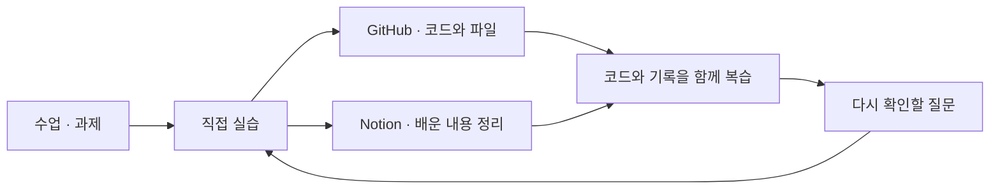

  

  <a href="https://github.com/ChoiMgHub/security-agent-toolkit"><b>실습 코드</b></a>
  &nbsp; · &nbsp;
  <a href="#교육-과제"><b>교육 과제</b></a>
  &nbsp; · &nbsp;
  <a href="#배우고-남기는-방식"><b>학습 기록</b></a>

## 안녕하세요, 최민기입니다

전자공학을 전공했고, 현재 **SKT ALEPH K-뉴딜 아카데미**에서 AI·보안·자동화를 배우며 IT 분야 취업을 준비하고 있습니다.

수업이 끝나면 그날 배운 내용과 실습 과정을 다시 정리합니다. **Notion에는 복습 기록을, GitHub에는 실습 코드와 파일을** 남기고 있습니다. 나중에 다시 봤을 때 코드가 왜 그렇게 동작하는지 설명할 수 있는 기록을 쌓아가고 싶습니다.

> 배운 것을 직접 실행하고, 다시 설명할 수 있도록 기록합니다.

## 지금 배우는 것

| 학습 주제 | 수업에서 연습한 내용 |
| :--- | :--- |
| **Python · 로그 처리** | 자료구조와 함수, CSV·JSON 입출력, 예외 처리, 정규표현식, 로그 정규화와 탐지 룰 |
| **API · 자동화** | `requests`로 외부 API 조회, Flask 웹훅, `argparse`, 중복 처리 방지, `schedule` |
| **LLM · 에이전트** | API 호출, 프롬프트 작성, JSON 응답 파싱, 도구 선택·실행과 승인 흐름 |
| **경보 요약 · 보고서** | 경보를 묶어 요약하기, 위험도 정렬, 총평 생성, Markdown 보고서 저장 |

Python을 중심으로 실습하고, VS Code·Jupyter·Git Bash·GitHub를 사용해 코드와 파일을 관리하는 방법도 함께 익히고 있습니다.

## 실습 코드

### [security-agent-toolkit ↗](https://github.com/ChoiMgHub/security-agent-toolkit)

SKT ALEPH 수업에서 다룬 코드와 실습 파일을 모으는 저장소입니다. Python 기초에서 시작해 로그 처리, 웹훅, 스케줄러, LLM 도구 실행으로 배운 내용을 연결하고 있습니다.

| 살펴볼 부분 | 바로가기 |
| :--- | :--- |
| **기초 문법과 로그 처리** — 수업용 노트북과 실습 파일 | [agent_core](https://github.com/ChoiMgHub/security-agent-toolkit/tree/main/agent_core) |
| **웹훅과 정기 점검** — 요청 수신과 처리 이력 확인 | [webhook_server.py](https://github.com/ChoiMgHub/security-agent-toolkit/blob/main/agent_core/webhook_server.py) · [scheduler_job.py](https://github.com/ChoiMgHub/security-agent-toolkit/blob/main/agent_core/scheduler_job.py) |
| **LLM 호출과 도구 연결** — 응답 파싱과 도구 라우팅 | [llm_client.py](https://github.com/ChoiMgHub/security-agent-toolkit/blob/main/agent_core/llm_client.py) · [tool_router.py](https://github.com/ChoiMgHub/security-agent-toolkit/blob/main/agent_core/tool_router.py) |

## 교육 과제

수업 과제로 만든 웹 결과물입니다. 각 저장소에서 구현한 코드와 구성을 볼 수 있습니다.

| 저장소 | 만든 것 | 주요 내용 |
| :--- | :--- | :--- |
| [**SKT-ALEPH-01**](https://github.com/ChoiMgHub/SKT-ALEPH-01) | 자기소개 페이지 | 전공과 학습 방향, 교육에 참여한 이유 소개 |
| [**SKT-ALEPH-02**](https://github.com/ChoiMgHub/SKT-ALEPH-02) | 패킷 디펜스 게임 | 30초 게임, 점수·체력·일시정지 기능 |
| [**SKT-ALEPH-03**](https://github.com/ChoiMgHub/SKT-ALEPH-03) | 짤·카드 스튜디오 | 이미지·문구 편집, PNG 저장, JSON 템플릿 관리 |
| [**SKT-ALEPH-04**](https://github.com/ChoiMgHub/SKT-ALEPH-04) | 환율 정보판 | 외부 API 조회, 날짜별 기록, 오류·회복 시나리오 |

## 배우고 남기는 방식

실습 코드와 복습 기록을 함께 남기고, 다시 볼 때는 입력과 출력부터 따라가 보려고 합니다.

- **기록:** 배운 내용과 사용한 코드, 실행 결과를 함께 남깁니다.
- **확인:** 자료의 예시와 실제 출력이 다르면 구분해서 적습니다.
- **복습:** 헷갈리는 부분은 원본 자료와 코드로 돌아가 다시 확인하려고 합니다.

<b>앞으로 더 익히고 싶은 것</b>

- 로그가 어떤 조건에서 경보로 이어지는지 코드로 설명하기
- LLM의 응답을 원본 데이터와 대조하고, 도구 실행 과정을 이해하기
- 실습 파일을 정리해 시간이 지난 뒤에도 다시 실행하고 복습하기

---

  수업에서 배운 내용을 하나씩 쌓아가는 중입니다. · ChoiMgHub

